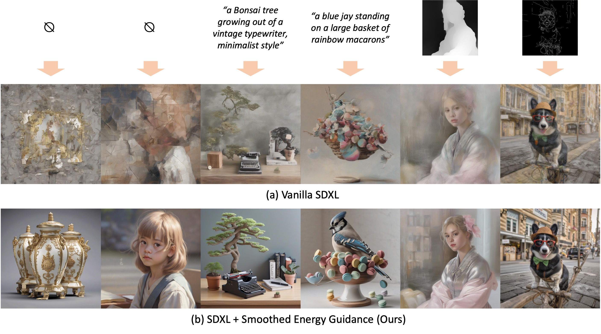
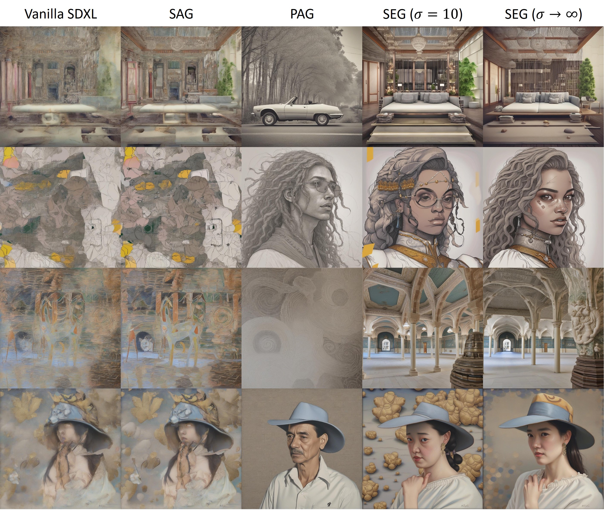
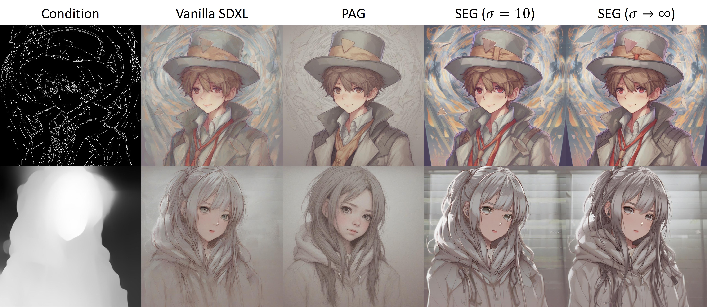

# Smoothed Energy Guidance for SDXL

| **SEG Paper** | **SEG** | **SEG+ControlNet** |
|----------------------|----------------------|----------------------|
| [](https://colab.research.google.com/github/SusungHong/seg_private/blob/master/sdxl_seg.ipynb) | [](https://colab.research.google.com/github/SusungHong/seg_private/blob/master/sdxl_seg.ipynb) | [](https://colab.research.google.com/github/SusungHong/seg_private/blob/master/sdxl_controlnet_seg.ipynb) |


Official implementation of [Smoothed Energy Guidance: Guiding Diffusion Models with Reduced Energy Curvature of Attention]().

<p align="center">
  
</p>

## 🏔️ What is Smoothed Energy Guidance? How does it work?

**Smoothed Energy Guidance (SEG)** is a training- and condition-free approach that leverages the energy-based perspective of the self-attention mechanism to improve image generation.

**Key points:**
- Does not rely on the guidance scale parameter that causes side effects when the value becomes large
- Allows continuous control of the original and maximally attenuated curvature of the energy landscape behind self-attention
- Introduces a query blurring method, equivalent to blurring the entire attention weights without significant computational cost

Please check **[our paper]()** for details.

## 🔍 Comparison with other works

SEG does not severely suffer from side effects such as making the overall image grayish or significantly changing the original structure, while improving generation quality even without prompts.

### Unconditional generation without prompts
<p align="center">
  
</p>

### ControlNet generation without prompts
<p align="center">
  
</p>

## 🛠️ Installation

We use the following versions of `torch` and `diffusers`:

```
- torch 2.0.1
- diffusers 0.27.2
```

## 🚀 Quickstart

Get started with our Jupyter notebook demos:
1. `sdxl_seg.ipynb`: Basic usage with SDXL
2. `sdxl_controlnet_seg.ipynb`: Integration with ControlNet

This is an example of a Python script:
```python
from pipeline_seg import StableDiffusionXLSEGPipeline
pipe = StableDiffusionXLSEGPipeline.from_pretrained(
    "stabilityai/stable-diffusion-xl-base-1.0",
    torch_dtype=torch.float16
)

device = "cuda"
pipe = pipe.to(device)
prompts = [""]
seed = 10

generator = torch.Generator(device="cuda").manual_seed(seed)
output = pipe(
    prompts,
    num_inference_steps=25,
    guidance_scale=1.0,
    seg_scale=3.0,
    seg_blur_sigma=100.0,
    seg_applied_layers=['mid'],
    generator=generator,
).images
```

**Parameters:**
- `seg_scale`: The scale of SEG. We generally fix this parameter to `3.0`. Please increase it if the result with infinite blur is still not satisfactory.
- `seg_blur_sigma`: The amount by which we blur the attention weights. Setting this value greater than 9999.0 results in infinite blur, which means uniform queries. Controlling it exponentially (e.g., 1, 4, 16, ...) is empirically effective.
- `seg_applied_layers`: The layer(s) in which we blur the attention weights. We use `['mid']` by default.

## 🙏 Acknowledgements

This project builds upon the excellent work of:
- [Self-Attention Guidance (SAG)](https://arxiv.org/abs/2210.00939)
- [PAG for SDXL](https://huggingface.co/multimodalart/sdxl_perturbed_attention_guidance) by Apolinário from multimodal AI art
- [Perturbed Attention Guidance (PAG)](https://arxiv.org/abs/2403.17377) by Ahn et al.

## 📚 Citation

If you use Smoothed Energy Guidance in your research or projects, please cite the following:

```bibtex
@article{hong2022improving,
  title={Improving Sample Quality of Diffusion Models Using Self-Attention Guidance},
  author={Hong, Susung and Lee, Gyuseong and Jang, Wooseok and Kim, Seungryong},
  journal={arXiv preprint arXiv:2210.00939},
  year={2022}
}
```
